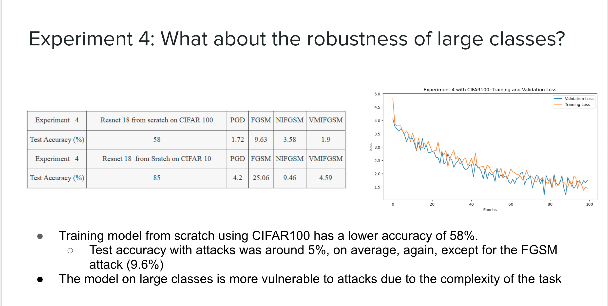

# Practical_Deep_Learning_Project
What Can We Learn From the State-of-the-art Adversarial Attacks on Transfer Learning?
Teammate: \
Jing Dong \
Ganghua Mei \

# Motivation 

Deep neural networks are vulnerable to adversarial examples that mislead the models with imperceptible perturbations. Transfer learning aims to leverage models pre-trained on source data to efficiently adapt to target setting, where only limited data are available for model fine-tuning.
Little research that combines adversarial training with transfer learning has been conducted. So we hope to experiment the adversarial training with transfer learning and model from scratch to compare the performance.

# Code introduction 
**trainer.py**: the train and test function defined\
**utils.py**: the functiosn will be used such as creating a dataset etc \
**finetune_framework.py**: the transfer learning frame work\
**model directory**: the base shallow CNN model and the ResNet model

# Implementation Details: 
Deep learning framework : Pytorch 1.7.1, + cu110, torchvision 0.8.2+cu110 torchaudio 0.7.2 \
Platform: GCP \
Machine Type: N1-highmem-8, T4 \
Toolbox: torchattacks

# Prepare to execute: 
first pip install -r requirements.txt\
then pip install tensorboard \
for some vm: run the following in the terminals: 
sudo add-apt-repository ppa:ubuntu-toolchain-r/test \
sudo apt-get update \
sudo apt-get install gcc-4.9 \
sudo apt-get upgrade libstdc++6\
**Note** : due to the vm config varies,  the set up may need customized adjustment
# How to execute code? 
Please download the jupyter notebook and directly run the code
# Solution Architecture

# Experiments & observations 

# Conclusion:

**We conduct four experiments to investigate the impacts of classic and state-of-the-art adversarial attacks on Transfer Learning using CIFAR10 and CIFAR 100**

Adversarial Training is highly effective on model from scratch with white-box attack\
Transfer learning model is much more vulnerable to adversarial attacks\
FGSM attack is weak on pretrained models\
Training models from scratch without pretrained layers have a better performance and are more robust to adversarial attacks\
Training models from scratch with larger classes have relatively lower accuracy with or without adversarial training due to the increasing level of task complexity

