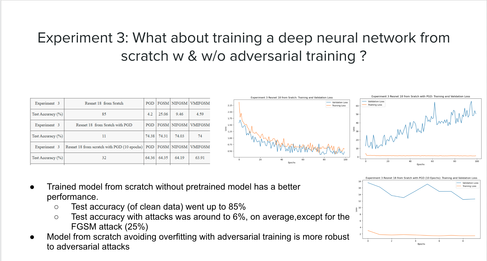

# Practical_Deep_Learning_Project
This is the Computer Vision Adversarial Training project
# Motivation 

Deep neural networks are vulnerable to adversarial examples that mislead the models with imperceptible perturbations. Transfer learning aims to leverage models pre-trained on source data to efficiently adapt to target setting, where only limited data are available for model fine-tuning.
Little research that combines adversarial training with transfer learning has been conducted. So we hope to experiment the adversarial training with transfer learning and model from scratch to compare the performance.

# Code introduction 
**trainer.py**: the train and test function defined\
**utils.py**: the functiosn will be used such as creating a dataset etc \
**finetune_framework.py**: the transfer learning frame work\
**model directory**: the base shallow CNN model and the ResNet model

# Prepare to execute: 
first pip install -r requirements.txt\
then pip install tensorboard \
for some vm: run the following in the terminals: 
sudo add-apt-repository ppa:ubuntu-toolchain-r/test \
sudo apt-get update \
sudo apt-get install gcc-4.9 \
sudo apt-get upgrade libstdc++6
# How to execute code? 
Please download the jupyter notebook and directly run the code
# Solution Architecture

# Experiments & observations 

